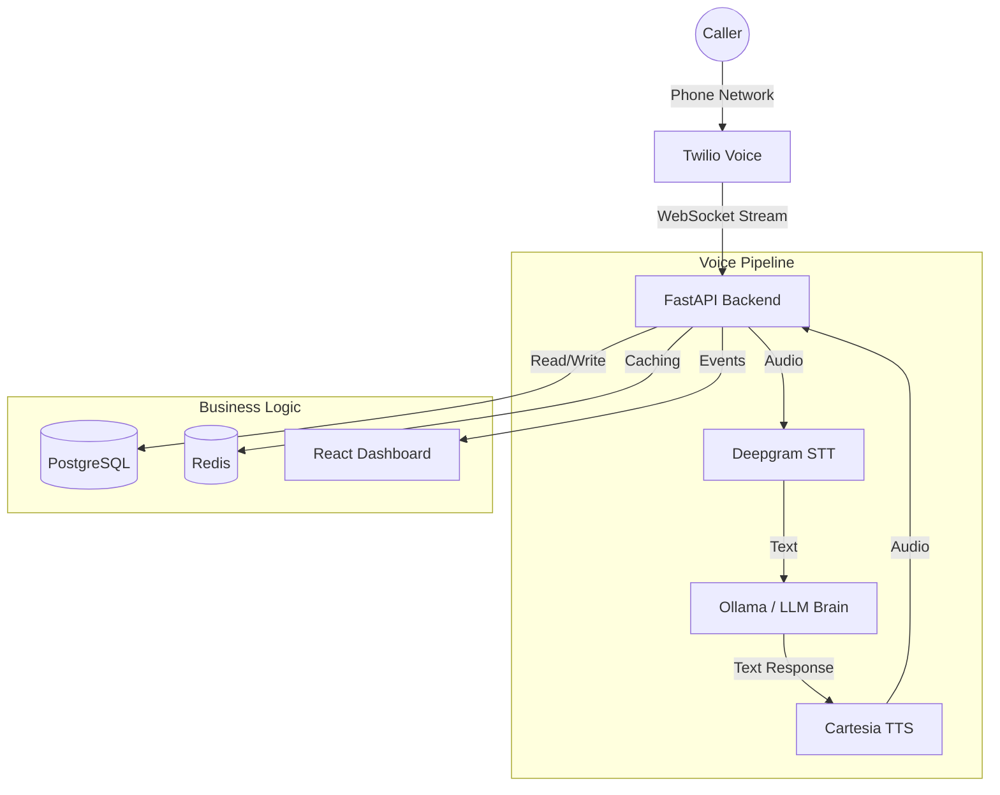

# 🎙️ Voice AI Receptionist & Booking System

> **The 24/7 Intelligent Front Desk for High-Value Businesses.**
> *Answers calls, answers questions, and books appointments instantly.*


---

## 📖 What is this Project?

This is a complete, production-grade **Voice AI platform** designed to replace traditional voicemail and basic phone trees.

Unlike standard IVR systems ("Press 1 for Sales"), this system listens to the caller, understands their intent using LLMs, and speaks back with a human-like voice in real-time. It connects directly to a live database to schedule appointments, check availability, and manage customer data.

### The Business Problem
Small businesses (Dentists, Med Spas, Lawyers) miss **20-30% of calls**, often during lunch breaks or after hours. Every missed call is a missed opportunity, potentially worth hundreds of dollars.

### The Solution
This software acts as an **Artificial Employee** that:
1.  **Picks up instantly** (0 ring wait).
2.  **Understands natural language** ("I need a cleaning next Tuesday").
3.  **Accesses real inventory** to confirm open slots.
4.  **Sends SMS confirmations** automatically.
5.  **Notifies human staff** via a real-time dashboard.

---

## ⚡ Key Features

| Feature | Description | Business Value |
|---------|-------------|----------------|
| **Ultra-Low Latency** | ~500ms voice-to-voice response time. | feels like talking to a human, not a robot. |
| **Real-Time Booking** | Dynamic slot checking in PostgreSQL DB. | No double-bookings; fully automated scheduling. |
| **Barge-In Support** | Users can interrupt the AI while it speaks. | Natural, fluid conversation flow. |
| **Omni-Channel** | Sends SMS/Email confirmations via Twilio/SMTP. | Reduces "no-show" rates with instant proof. |
| **Live Dashboard** | React Admin Panel using WebSockets. | Owners see calls happening live and can take over. |
| **Analytics** | Tracks conversion rates and missed opportunities. | actionable insights into business performance. |

---

## 🏗️ Architecture

The system uses a modern, event-driven architecture optimized for speed:



---

## 🛠️ Technology Stack

-   **Core Backend**: Python 3.11, FastAPI (Async)
-   **Database**: PostgreSQL 15, Redis 7 (Caching/Rate Limiting)
-   **Frontend**: React 18, Vite, TailwindCSS
-   **AI Services**:
    -   **Deepgram Nova-2**: Speech-to-Text (Transcriber)
    -   **Groq / Ollama**: LLM Inference (Brain)
    -   **Cartesia Sonic**: Text-to-Speech (Voice)
-   **Telephony**: Twilio Media Streams
-   **Infrastructure**: Docker Compose, Nginx (Reverse Proxy)

---

## 📚 Documentation Index

We have created specialized guides for every aspect of this project:

### 🚀 Getting Started
-   **[DEPLOYMENT.md](docs/DEPLOYMENT.md)**: How to install and run this on a server.
-   **[AGENCY_PLAYBOOK.md](AGENCY_PLAYBOOK.md)**: How to sell this as a service to clients (Business Guide).

### 🔮 Future & Value
-   **[PROJECT_EVOLUTION.md](PROJECT_EVOLUTION.md)**: Roadmap for V2 (SaaS, RAG, Integrations).
-   **[PROJECT_VALUATION.md](PROJECT_VALUATION.md)**: Analysis of the project's financial worth.

### ⚙️ Operations
-   **[next_steps.md](next_steps.md)**: Maintenance schedule and handoff status.

---

## 🚦 Quick Start (Local Dev)

```bash
# 1. Setup Environment
make setup

# 2. Config
cp .env.example .env

# 3. specific start
make dev
```

Visit the Admin Dashboard at `http://localhost:5173`
